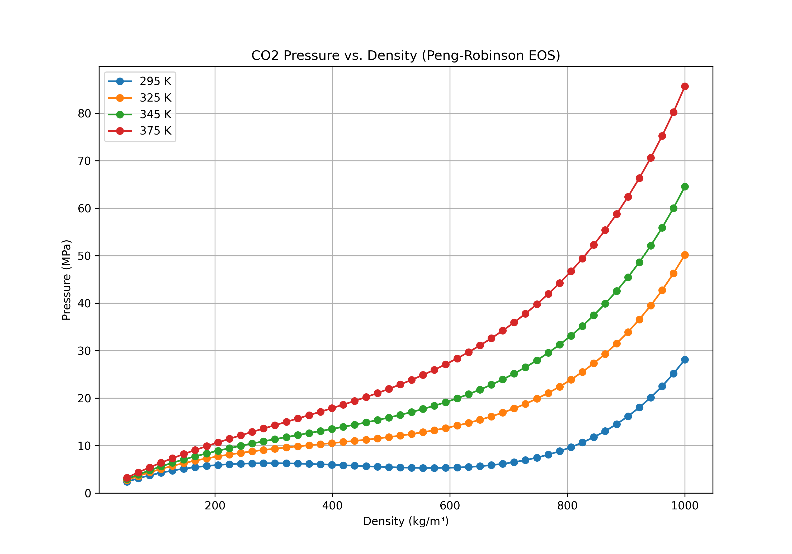

# CO2 Pressure-Density Plot using Peng-Robinson Equation of State

This repository contains a Python script that calculates and plots the pressure of Carbon Dioxide (CO2) over a range of densities and temperatures using the Peng-Robinson Equation of State (EOS).



## Description

The script `plot_co2_eos.py` defines the physical constants for CO2 and uses the Peng-Robinson EOS formula to compute the corresponding pressure for the following temperatures:
- 295 K
- 325 K
- 345 K
- 375 K

The resulting Pressure-Density curves are plotted using Matplotlib and saved as `co2_eos_plot.png`.

## How to Run

### 1. Prerequisites
- Python 3.x
- `pip` (Python package installer)

### 2. Installation
Clone the repository and install the required packages:

```bash
git clone [https://github.com/your-username/co2-equation-of-state.git](https://github.com/your-username/co2-equation-of-state.git)
cd co2-equation-of-state
pip install -r requirements.txt
```

### 3. Execution
Run the script from your terminal:
```bash
python plot_co2_eos.py
```
This will display the plot and save a copy as `co2_eos_plot.png` in the project directory.

## Equation of State
The script implements the Peng-Robinson EOS:
$$ P = \frac{RT}{v-b} - \frac{a(T)}{v(v+b) + b(v-b)} $$
Where $P$ is pressure, $T$ is temperature, $v$ is molar volume, and $R$ is the universal gas constant. The parameters $a(T)$ and $b$ are calculated based on the critical properties of CO2.
